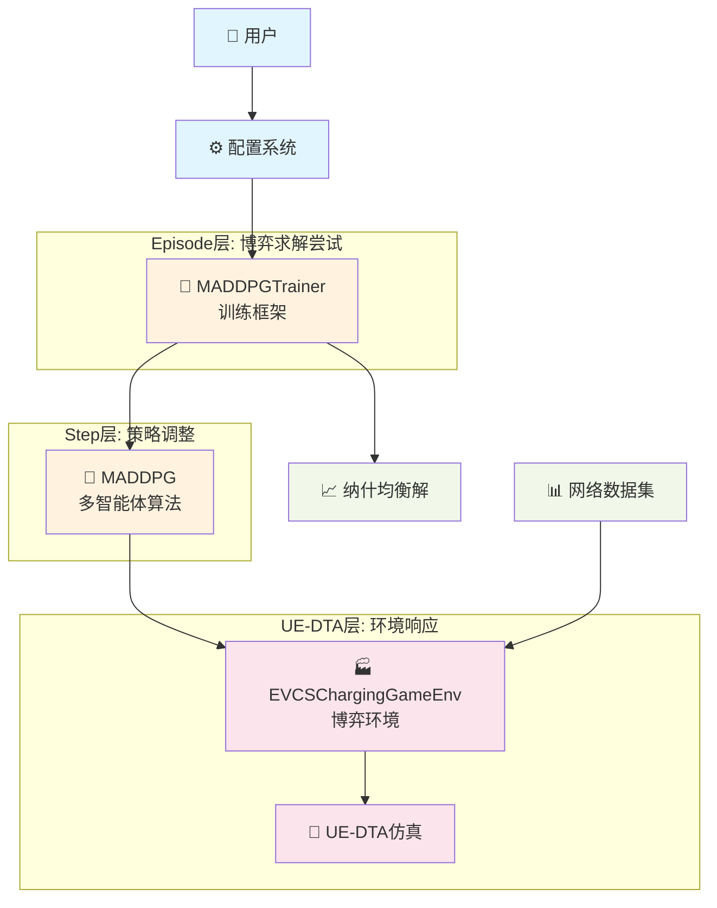

# CLAUDE.md

This file provides guidance to Claude Code (claude.ai/code) when working with code in this repository.

## 项目总览

### 核心目标

这是一个基于Python的**电动汽车充电站(EVCS)价格博弈仿真项目**，核心目标是**求解充电站间价格竞争的纳什均衡解**。

项目通过AI方法解决传统数学方法无法处理的复杂博弈均衡问题，为充电基础设施的定价策略和城市规划提供科学依据。

### 关键技术特性

- **通用博弈环境框架**：可加载不同交通网络数据集，适配多种城市场景
- **空间差异化博弈建模**：考虑充电站地理位置差异的产品差异化竞争
- **UE-DTA交通仿真集成**：模拟用户基于总成本(出行时间+充电价格)的路径选择行为  
- **MADDPG多智能体学习**：求解多个充电站在多个时段的连续价格策略纳什均衡
- **基于有限路径的近似方法**：将无限路径问题简化为计算可行的k条路径选择

### 环境与算例

**抽象环境设计**：项目实现了一个通用的充电站价格博弈环境，可以加载不同的交通网络数据集。

**算例数据**：当前可加载真实城市交通网络数据（如Sioux Falls网络），包含：
- 网络节点和道路链路数据
- 起终点对交通需求数据  
- 充电站位置和定价边界配置

**场景适配**：通过更换数据集，环境可以适配不同城市规模和充电站布局的博弈场景。

### 项目组成

**1. 博弈环境实现** (`src/env/EVCSChargingGameEnv.py`)
- 建模用户均衡动态交通分配(UE-DTA)与充电站定价竞争
- 完整的PettingZoo ParallelEnv接口
- 自环充电链路 + 多状态图路径算法
- Monkey Patch增强的UXSim交通仿真

**2. MADDPG算法实现** (`src/algorithms/maddpg/`)  
- 基于"中心化训练，去中心化执行"的多智能体深度强化学习
- 全局观测去重优化和博弈特定奖励归一化
- 可配置网络架构和动态批次调整

**3. 训练框架** (`src/trainer/MADDPGTrainer.py`)
- 三层训练架构：Episode(博弈尝试) → Step(策略调整) → UE-DTA(环境响应)
- 纳什均衡收敛检测和训练过程可视化
- 完整的实验数据记录和结果分析

## 理论基础

### 博弈论模型定义

本项目实现的是**单步静态不完全信息空间差异化定价博弈**，具有以下核心特征：

**博弈结构**：
- **智能体集合**：N个充电站（数量可配置）
- **策略空间**：S_i = [price_min, price_max]^T （每个充电站在T个时段的价格选择）
- **收益函数**：R_i = Σ(p_i,t × q_i,t) （价格×充电流量的总收益）
- **信息结构**：智能体观测上轮所有充电站价格和自身充电流量

**关键特征**：
- **空间差异化**：充电站地理位置不同，形成产品差异化竞争
- **间接需求响应**：用户基于总成本选择路径，总成本 = 出行时间成本 + 充电价格
- **静态同时博弈**：所有充电站同时设定价格策略
- **不完全信息**：智能体无法观测其他充电站的实时充电流量

**与经典博弈对比**：
- vs. Bertrand竞争：非同质产品，用户考虑总成本而非仅价格
- vs. Hotelling空间竞争：相似的空间差异化和局部垄断力特征

### 纳什均衡求解思路

**均衡定义**：在纳什均衡点，任何充电站单方面改变价格策略都无法获得更高收益。

**求解挑战**：
- **需求函数不可解析**：充电流量依赖复杂的UE-DTA仿真，无法写出解析表达式
- **策略空间庞大**：多智能体×多时段×连续价格空间
- **收益函数非凸**：基于交通仿真的收益函数不可微、多峰
- **智能体耦合**：每个充电站收益受所有其他充电站价格影响

**多轮训练澄清**：MADRL中的"重复博弈"是**算法求解工具**，不是博弈本身的性质
- 博弈定义：单次价格设定博弈（固定不变）
- 多轮训练目的：通过梯度学习逼近纳什均衡
- 每轮reset()：重新初始化同一博弈，尝试找到更好的策略

### MADRL方法选择原因

**传统方法失效**：解析求解、数值迭代等方法在面对高维非凸耦合博弈时计算不可行。

**MADRL优势**：
- **处理复杂环境**：通过仿真环境隐式建模需求响应关系
- **连续策略空间**：适用于连续价格决策
- **多智能体协调**：自然处理智能体间的策略耦合
- **收敛保证**：在适当条件下可收敛到纳什均衡

**预期输出**：
```python
# 多个纳什均衡解（如果存在）
nash_equilibria = {
    "status": "converged",
    "total_equilibria": 2,      # 找到的均衡解数量
    "equilibria": [
        {
            "episode": 5,
            "equilibrium_prices": {
                "充电站1": [p_1_1, p_1_2, ..., p_1_T],
                "充电站2": [p_2_1, p_2_2, ..., p_2_T],
                # ... 其他充电站
            },
            "equilibrium_rewards": {...},  # 各站收益（稳定步骤平均值）
            "stable_steps_count": 5        # 用于计算平均值的稳定步数
        },
        {
            "episode": 8,
            "equilibrium_prices": {...},   # 另一个均衡解
            "equilibrium_rewards": {...},
            "stable_steps_count": 5
        }
    ],
    "latest_equilibrium": {...}  # 最新的均衡解（向后兼容）
}
```

## 系统架构设计

### 整体架构图



### EVCSChargingGameEnv设计

#### 核心设计理念
- **通用性**：支持加载不同交通网络数据集，适配多种城市场景
- **精确性**：通过预定路径确保充电行为的确定性建模
- **简洁性**：采用最简化的网络拓扑设计，降低复杂度

#### 关键技术设计

**1. 自环充电链路设计**
```python
# 为每个充电节点创建自环链路 node -> node
charging_link_name = f"charging_{node_id}" 
# 通过链路参数控制充电时间
length = charging_link_length        # 配置文件设定
free_flow_speed = charging_speed     # 配置文件设定
```

**2. 多状态图路径算法**
```python
# 构建双状态图：uncharged状态 + charged状态
# 普通链路：状态保持
G.add_edge("uncharged_A", "uncharged_B", ...)
G.add_edge("charged_A", "charged_B", ...)

# 充电链路：状态转换 uncharged -> charged  
G.add_edge("uncharged_node", "charged_node", ...)

# 路径搜索：确保恰好一次充电
paths = nx.shortest_simple_paths(G, "uncharged_source", "charged_target")
```

**3. 基于有限路径的近似均衡分配**
- 预计算k条最短充电/非充电路径
- 使用预定路径Vehicle严格按路径行驶
- 通过路径切换概率实现用户均衡

**4. Monkey Patch统一解决方案**
```python
# 统一增强UXSim功能，解决：
# - Analyzer文件夹创建问题
# - Vehicle预定路径功能（转移确认机制）
# - World类增强功能
patch_uxsim()  # 在环境初始化时调用
```

#### PettingZoo接口设计
```python
# 观测空间：智能体局部+全局价格信息
observation_space = spaces.Dict({
    "last_round_all_prices": spaces.Box(shape=(n_agents, n_periods)),
    "own_charging_flow": spaces.Box(shape=(n_periods,))
})

# 动作空间：归一化价格[0,1]
action_space = spaces.Box(low=0.0, high=1.0, shape=(n_periods,))

# 奖励函数：价格×流量总收益
reward_i = sum(price_i_t * flow_i_t for t in periods)
```

#### UE-DTA集成
1. **路径预计算**：多状态图枚举所有OD对的k条路径
2. **仿真执行**：预定路径Vehicle严格按路径行驶
3. **成本计算**：time_value_coefficient × 旅行时间 + 充电价格
4. **路径调整**：基于成本差异的随机切换机制
5. **收敛判断**：平均成本差小于阈值

### MADDPG算法架构

#### 网络设计要点

**Actor网络**：MLP架构，适合静态同时博弈
```python
# 选择MLP而非LSTM：8个时段价格为独立决策，无时序依赖
class ActorNetwork:
    def __init__(self, obs_dim, action_dim=8, hidden_sizes=(64, 64)):
        # 可配置隐藏层，Sigmoid确保输出[0,1]
```

**Critic网络**：中心化训练，接收全局信息
```python
class CriticNetwork:
    def __init__(self, global_obs_dim, hidden_sizes=(128, 64)):
        # 处理全局状态，输出Q值估计
```

**全局观测去重优化**：
```python
def organize_global_state(observations, actions):
    # 去重策略：全局价格信息只保留一份
    global_prices = observations[agent_0]["last_round_all_prices"]  # 去重
    all_flows = [obs["own_charging_flow"] for obs in observations]  # 保留
    all_actions = [actions[agent] for agent in sorted_agents]      # 保留
    # 优化效果：参数量从192维减少到96维
```

#### 训练策略设计

**探索策略**：高斯噪音 + 指数衰减
```python
# 适合静态博弈：各时段独立探索
noise = GaussianNoise(sigma=0.2, decay=0.9995, min_sigma=0.01)
```

**奖励工程**：博弈特定归一化
```python
# 当轮最大值正仿射变换，保持纳什均衡等价性
normalized_reward = reward / max(current_round_rewards)
```

**经验回放**：动态批次大小
```python
# 根据缓冲区大小自适应调整，最小8个经验即开始学习
batch_size = min(max_batch_size, max(8, buffer_size // 2))
```

### 训练框架设计

#### 三层架构
```python
# Episode层：博弈求解尝试
for episode in max_episodes:
    observations = env.reset()  # 重新初始化同一博弈
    
    # Step层：策略调整循环
    for step in max_steps_per_episode:
        actions = maddpg.take_action(observations)
        # UE-DTA层：环境响应（在env.step()内部）
        next_obs, rewards, terminations, infos = env.step(actions)
        
        if all(terminations.values()):  # 纳什均衡收敛
            break
```

#### 收敛检测
```python
# 环境层：基于价格相对变化率
relative_change = abs(current_prices - prev_prices) / (prev_prices + 1e-8)
converged = mean(relative_change) < threshold

# 训练层：连续收敛检测
stable_convergence = len(recent_convergence_episodes) >= stable_episodes_required
```

#### 进度监控
- **Episode层**：寻找纳什均衡总体进度
- **Step层**：单次博弈内策略调整过程  
- **UE-DTA层**：交通仿真内部迭代过程

## 实现状态

### 已完成功能

项目已完成**完整的端到端实现**，包含从环境建模到算法训练的全部组件：

#### **环境实现** ✅
- **EVCSChargingGameEnv** (1,158行)：完整的PettingZoo ParallelEnv接口
- **自环充电链路建模**：`charging_{node_id}` 自环链路创建和管理
- **多状态图路径算法**：uncharged/charged状态转换的k最短路径计算
- **UE-DTA仿真集成**：Day-to-Day动态均衡算法，支持路径切换和收敛检测
- **Monkey Patch增强** (276行)：统一解决UXSim兼容性问题

#### **算法实现** ✅  
- **MADDPG核心算法** (590行)：完整的中心化训练、去中心化执行框架
- **神经网络架构** (143行)：可配置的Actor/Critic网络，支持任意隐藏层
- **全局观测去重优化**：`organize_global_state`函数实现参数量减半
- **博弈特定设计**：奖励归一化、动态批次调整、高斯噪音探索

#### **训练框架** ✅
- **MADDPGTrainer** (370行)：三层架构训练器，支持纳什均衡收敛检测
- **配置系统** (74行)：MADDPGConfig和TrainingConfig完整参数管理
- **进度监控**：Episode/Step/UE-DTA三层进度显示
- **实验记录**：完整的训练数据自动保存和结果分析

#### **工程完善** ✅
- **项目结构**：清晰的模块化组织，总计约2,758行代码
- **入口程序** (111行)：完整的演示和测试脚本
- **可配置性**：支持不同网络数据集加载，参数完全可配置

### 当前架构概览

```
src/
├── env/                     # 博弈环境
│   ├── EVCSChargingGameEnv.py    # 主环境实现
│   └── patch.py                  # UXSim增强补丁
├── algorithms/              # MADDPG算法
│   └── maddpg/
│       ├── maddpg.py            # 核心算法
│       └── networks.py          # 神经网络
├── trainer/                 # 训练框架
│   └── MADDPGTrainer.py         # 训练器
└── utils/                   # 工具模块
    └── config.py                # 配置管理
```

### 核心特性验证

#### **deltan概念处理** ✅
- UXSim中每个Vehicle对象代表多辆实际车辆的"platoon"概念
- 所有车辆数统计正确显示实际数量（Vehicle对象数 × deltan）
- 充电流量统计考虑deltan影响，确保数据准确性

#### **技术难点解决** ✅
- **转移确认机制**：解决自环链路的Vehicle路径执行问题
- **路径执行保证**：通过预定路径实现100%路径匹配
- **收敛稳定性**：基于相对变化率的价格收敛检测

## 开发指南

### 快速开始

#### 环境准备
```bash
# 安装依赖
pip install -r requirements.txt

# 直接运行训练
python main.py
```

#### 基本使用
项目采用**配置驱动**的设计，所有参数通过 `src/utils/config.py` 进行配置：

```python
# 修改训练配置
class TrainingConfig:
    network_dir: str = 'siouxfalls'          # 网络数据文件夹
    network_name: str = 'siouxfalls'         # 网络名称
    max_episodes: int = 100                  # 最大训练轮数
    max_steps_per_episode: int = 50          # 每轮最大步数
    convergence_threshold: float = 0.01      # 纳什均衡收敛阈值
    stable_steps_required: int = 5           # 单episode内连续收敛步数要求
    stable_episodes_required: int = 3        # 训练终止的连续收敛episodes要求

# 修改算法配置  
class MADDPGConfig:
    actor_hidden_sizes: tuple = (64, 64)     # Actor网络结构
    critic_hidden_sizes: tuple = (128, 64)   # Critic网络结构
    actor_lr: float = 0.001                  # 学习率
    buffer_capacity: int = 10000             # 经验回放容量
```

### 配置说明

#### 网络数据配置
配置文件位置：`{network_dir}/{network_name}_settings.json`

**关键参数**：
```json
{
    "charging_nodes": {"5": [0.1, 1.0], "12": [0.1, 1.0], ...},  // 充电站及价格范围
    "charging_periods": 8,                    // 时段数量
    "charging_car_rate": 0.3,                // 充电车辆比例
    "routes_per_od": 5,                       // 每个OD对的路径数
    "charging_link_length": 3000,             // 充电链路长度(m)
    "charging_link_free_flow_speed": 10,      // 充电速度(m/s)
    "time_value_coefficient": 0.005,          // 时间价值系数
    "ue_convergence_threshold": 1.0,          // UE收敛阈值
    "deltan": 5                               // Vehicle批次大小
}
```

**deltan概念**：UXSim中的关键参数，定义每个Vehicle对象代表的实际车辆数量。影响仿真精度与计算效率的平衡。

#### 网络数据格式
项目支持标准的交通网络数据格式：
- `{network_name}_nodes.csv`: 节点坐标数据
- `{network_name}_links.csv`: 链路容量和速度数据  
- `{network_name}_demand.csv`: OD需求数据
- `{network_name}_settings.json`: 博弈配置参数

### 项目结构

```
ChargingGame/
├── main.py                    # 主入口程序
├── requirements.txt           # 依赖管理
├── siouxfalls/               # 示例网络数据
│   ├── siouxfalls_nodes.csv
│   ├── siouxfalls_links.csv  
│   ├── siouxfalls_demand.csv
│   └── siouxfalls_settings.json
└── src/
    ├── env/                  # 博弈环境
    │   ├── EVCSChargingGameEnv.py  # 主环境
    │   └── patch.py               # UXSim增强
    ├── algorithms/           # MADDPG算法
    │   └── maddpg/
    │       ├── maddpg.py         # 核心算法
    │       └── networks.py       # 神经网络
    ├── trainer/              # 训练框架
    │   └── MADDPGTrainer.py      # 训练器
    └── utils/                # 工具模块
        └── config.py             # 配置管理
```

### 输出结果

训练完成后自动生成：
- **实验目录**：`results/experiment_{timestamp}/`
- **训练数据**：`step_records.json` 包含完整的训练过程记录
- **纳什均衡解**：收敛时的价格策略和收益信息
- **训练统计**：收敛率、episode长度、UE迭代次数等指标

### 扩展使用

#### 加载新的网络数据
1. 准备符合格式的网络数据文件
2. 修改 `TrainingConfig.network_dir` 和 `network_name`
3. 调整对应的 `{network_name}_settings.json` 配置

#### 调整博弈规模
- **充电站数量**：修改 `charging_nodes` 配置
- **时段数量**：修改 `charging_periods` 配置  
- **价格范围**：调整各充电站的 `[min_price, max_price]`

#### 算法参数调优
- **网络结构**：调整 `actor_hidden_sizes` 和 `critic_hidden_sizes`
- **学习参数**：修改学习率、批次大小、探索噪音等
- **收敛条件**：调整 `convergence_threshold`、`stable_steps_required` 和 `stable_episodes_required`

## 关键技术决策

### 环境设计决策

#### 1. 自环充电链路设计
**决策**：使用 `node -> node` 的自环链路模拟充电行为，而非节点分离或链路复制方案。

**原因**：
- **拓扑最简**：仅增加自环链路，不改变原网络结构
- **物理直观**：链路长度和速度参数直接控制充电时间
- **实现简洁**：避免复杂的网络拓扑变换

#### 2. 多状态图路径算法  
**决策**：构建 uncharged/charged 双状态图，确保充电车辆恰好充电一次。

**原因**：
- **精确控制**：强制恰好一次充电，避免随机性
- **算法清晰**：状态转换逻辑简单明确
- **扩展性好**：易于扩展到多次充电场景

#### 3. 基于有限路径的近似均衡分配
**决策**：将无限路径的UE-DTA问题简化为k条预定路径的离散选择。

**原因**：  
- **计算可行**：大幅降低路径搜索空间
- **质量保证**：k条最短路径能较好近似真实选择
- **确定执行**：预定路径Vehicle确保严格按路径行驶

#### 4. Monkey Patch统一解决方案
**决策**：通过运行时补丁增强UXSim功能，而非继承重写。

**原因**：
- **维护简单**：所有UXSim问题集中在单个模块解决
- **透明使用**：直接使用标准 `uxsim.World` 和 `uxsim.Vehicle`
- **性能优化**：避免不必要的文件I/O操作

### 算法设计决策

#### 5. 全局观测去重优化
**决策**：在 `organize_global_state` 中去除重复的全局价格信息。

**原因**：
- **参数效率**：网络参数量从192维减少到96维
- **训练稳定**：减少冗余信息，提升学习效率
- **内存友好**：降低GPU显存占用

#### 6. 博弈特定的奖励归一化
**决策**：使用当轮最大值进行正仿射变换，而非标准化或原始奖励。

**原因**：
- **理论保证**：正仿射变换保持纳什均衡等价性
- **数值稳定**：奖励范围[0,1]，适合神经网络训练
- **实现简单**：单行代码，无需复杂统计

#### 7. 动态批次大小调整
**决策**：根据经验回放缓冲区大小自适应调整batch_size，最小8个经验即开始学习。

**原因**：
- **快速启动**：单episode内尽早开始学习
- **适配环境**：匹配价格博弈的快速收敛特性
- **资源高效**：避免等待大量经验积累

### 训练架构决策

#### 8. 三层训练架构
**决策**：Episode(博弈尝试) → Step(策略调整) → UE-DTA(环境响应) 的清晰分层。

**原因**：
- **目标明确**：每层职责清晰，专注纳什均衡求解
- **进度透明**：三层进度条让用户了解训练各阶段
- **理论一致**：符合"多轮训练求解单步博弈"的理论框架
- **易于调试**：分层设计便于定位问题和性能分析

### 设计原则总结

上述技术决策体现了项目的核心设计原则：

1. **简洁性优先**：选择最简化的实现方案，降低系统复杂度
2. **理论指导**：所有设计决策都有明确的理论依据
3. **工程实用**：平衡理论完美性与实现可行性
4. **可扩展性**：预留扩展空间，支持不同规模的博弈场景